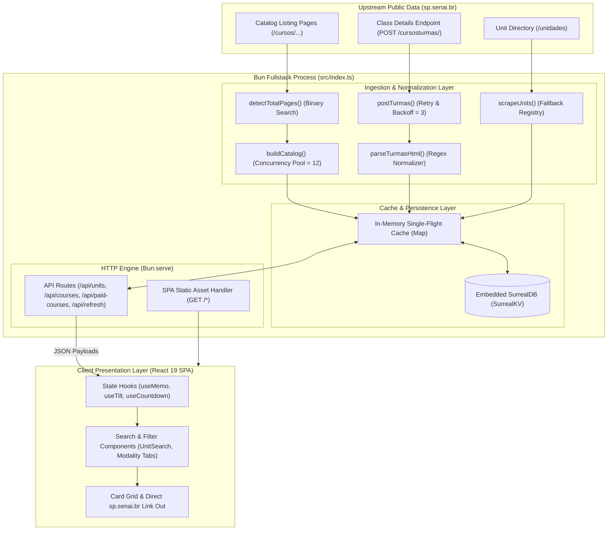

# SENAI-SP Course Intelligence

An open-source real-time course discovery and monitoring platform for SENAI São Paulo (SENAI-SP).

The platform continuously aggregates, normalizes, stores, and presents public course and class offerings across all monitored SENAI-SP units through a consolidated, searchable, and responsive web interface.

[](https://spsenai.arielaram.com)
[](https://github.com/ariel-aram/senai-cursos)
[](LICENSE)
[](#project-status)
[](https://bun.sh)
[](https://react.dev)
[](https://surrealdb.com)

---

## Quick Links

- **Live Application:** [spsenai.arielaram.com](https://spsenai.arielaram.com)
- **Source Repository:** [github.com/ariel-aram/senai-cursos](https://github.com/ariel-aram/senai-cursos)
- **Official SENAI-SP Portal:** [sp.senai.br](https://www.sp.senai.br)
- **Contribution Guide:** [CONTRIBUTING.md](CONTRIBUTING.md)
- **Documentation:**
  - [System Architecture](docs/architecture.md)
  - [HTTP API Reference](docs/api.md)
  - [Data Ingestion Engine](docs/scraping.md)
  - [Frontend Architecture](docs/frontend.md)
  - [Production Deployment](docs/deployment.md)

---

## Overview Metrics

| Metric | Value | Reference / Verification |
| ------ | ----- | ------------------------ |
| SENAI-SP units monitored | 75 | Catalog extraction & unit registry |
| Default UI refresh interval | 5 minutes (300 s) | `config.refreshIntervalSeconds` |
| Catalog cache TTL | 2 hours | `config.catalogTtlMs` |
| Unit class cache TTL | 30 minutes | `config.unitTtlMs` |
| Ingestion HTTP request timeout | 12 seconds | `config.fetchTimeoutMs` |
| Ingestion retry limit | 3 attempts | Exponential backoff (`300ms * 2^attempt`) |
| Storage backend | SurrealDB (SurrealKV embedded) | Persistent multi-engine KV store (`src/db.ts`) |
| Runtime architecture | Single-process fullstack | Bun serving React 19 SPA + REST API |
| License | Apache-2.0 | [LICENSE](LICENSE) |

---

## Why This Exists

### Problem

SENAI São Paulo offers hundreds of vocational, technical, and continuous education courses distributed across physical facilities throughout the State of São Paulo. While course listings and schedule details are publicly available on the official SENAI-SP portal, discovering openings across multiple campuses, differentiating between scholarship-funded (gratuito) and paid offerings, and tracking vacancy availability in real time requires repetitive manual navigation across disparate unit pages.

### Solution

SENAI-SP Course Intelligence provides an autonomous data aggregation and visualization layer. It routinely scans public course listings, queries class schedule endpoints with resilient concurrency and caching controls, persists structured records into an embedded SurrealDB database, and serves an intuitive interface with fast search, granular filtering, and direct enrollment shortcuts.

### Operating Principle & Institutional Clarity

This project is an independent open-source community effort and is **not affiliated with, endorsed by, or representing SENAI-SP or CNI**. It does not process enrollments, manage student records, or replace official portals. All course cards direct users straight to the official `sp.senai.br` domain for authoritative validation and enrollment completion.

---

## Key Features

- **Automated Course Discovery & Normalization:** Discovers and catalogs course offerings across all 75 monitored units with binary-search page detection.
- **Vacancy & Class Schedule Tracking:** Extracts total available vacancies, class counts, start dates (chronologically sorted), periods (Morning, Afternoon, Evening, Full-time), and exact schedules.
- **Dual Modality Segregation:** Explicitly separates free (bolsa de estudos 100%) and paid course offerings with verified price extraction (`R$`).
- **Resilient Multi-Tier Caching:** Implements single-flight in-memory caching paired with embedded SurrealDB (SurrealKV) persistence to eliminate redundant upstream load and ensure high availability.
- **Background Warmup Pipeline:** Pre-warms cache across all monitored units during server startup with controlled concurrency (`WARMUP_CONCURRENCY = 6`).
- **Real-Time Client Updates:** Automatic periodic refresh (5-minute countdown with pause/resume support) alongside manual on-demand refresh triggers.
- **Search & Multi-Filter UI:** Real-time search across course names and codes, unit selectors, modality tabs, period filters, and sorting controls.
- **Deep Links to Official Portals:** Every course card links straight to its corresponding page on `sp.senai.br`.
- **Lightweight Single-Process Architecture:** REST API and pre-bundled React 19 SPA delivered concurrently from a single native Bun HTTP process.

---

## Architecture



### Layer Roles and Responsibilities

- **Ingestion & Normalization Layer (`src/index.ts`):** Fetches public HTML pages using binary search boundary discovery, handles retries with exponential backoff (`300ms * 2^attempt`), normalizes dates (`YYYYMMDD` sorting), parses class schedules, and extracts pricing details.
- **Cache & Persistence Layer (`src/index.ts`, `src/db.ts`):** Employs single-flight in-memory promise memoization to coalesce concurrent requests, backed by embedded SurrealDB (SurrealKV engine) for local persistence across restarts.
- **HTTP Engine (`src/index.ts`):** Serves REST API endpoints for unit listings, free/paid courses, on-demand refresh triggers, and client SPA assets from a single unified Bun server.
- **Client Presentation Layer (`src/App.tsx`, `src/frontend.tsx`):** Delivers a responsive glassmorphism UI with real-time text search, unit selection, countdown timers, and deep links to official course pages.

---

## Data Pipeline

```text
[sp.senai.br] ──(HTTP GET/POST)──> [Ingestion Layer] ──(Regex/Sanitization)──> [Normalized Schema]
                                                                                       │
                                                                   ┌───────────────────┴──────────────────┐
                                                                   ▼                                      ▼
                                                       [In-Memory Cache (TTL)]               [SurrealDB (SurrealKV)]
                                                                   │                                      │
                                                                   └───────────────────┬──────────────────┘
                                                                                       ▼
                                                                             [REST API Endpoints]
                                                                                       │
                                                                                       ▼
                                                                             [React 19 UI / Client]
```

1. **Origin:** Publicly available catalog listings and class schedule HTML endpoints on `sp.senai.br`.
2. **Collection:** Catalog discovery executes via binary search over page indices (`[1, 25]`), fetching active pages with controlled concurrency (`CATALOG_CONCURRENCY = 12`). Class schedules are fetched per unit via HTTP POST with `AbortSignal` timeouts (12s).
3. **Parsing & Normalization:** Regular expressions decode HTML entities, extract vacancy totals, chronological start dates, class period schedules, and numeric price strings.
4. **Upstream Protection & Rate-Limiting Mitigation:**
   - **Single-Flight Request Deduplication:** If multiple concurrent requests query the same unit, they share the active pending Promise rather than initiating redundant upstream requests.
   - **Multi-Tier Caching:** Catalog data is cached for 2 hours (`CATALOG_TTL_MS`); unit schedules are cached for 30 minutes (`UNIT_TTL_MS`).
   - **Background Unit Warmup:** During startup, all 75 units are warmed sequentially with a concurrency cap (`WARMUP_CONCURRENCY = 6`) to distribute network load.
5. **Persistence:** Clean records (`Course`, `UnitInfo`) are upserted into SurrealDB (`senai.db`) using the local SurrealKV engine.
6. **Delivery & Visualization:** REST endpoints deliver typed JSON payloads to the React 19 interface for real-time filtering, search, and sorting.

---

## Technology Stack

| Technology | Role | Purpose in Project |
| ---------- | ---- | ------------------ |
| **[Bun](https://bun.sh)** (v1.x) | Fullstack Runtime & Tooling | Provides fast JavaScript execution, built-in HTTP server (`Bun.serve`), file bundling, and package management |
| **[TypeScript](https://www.typescriptlang.org)** (v5.x / 7.x tooling) | Type Safety & Domain Modeling | Guarantees strict static typing across shared schema definitions (`types.ts`), backend services, and UI components |
| **[React](https://react.dev)** (v19) | Frontend Architecture | Powers declarative UI rendering, interactive state management, and real-time client-side filtering |
| **[Tailwind CSS](https://tailwindcss.com)** (v4) | Styling Framework | Enables modern responsive layouts, glassmorphism visual styling, and custom OKLCH color palettes |
| **[SurrealDB](https://surrealdb.com)** (`@surrealdb/node`) | Embedded Database | Persists normalized course and unit records locally via SurrealKV engine without requiring external database servers |
| **[Biome](https://biomejs.dev)** | Linter & Code Formatter | Enforces code consistency, fast formatting, and static analysis across the codebase |
| **[Lucide React](https://lucide.dev)** | Icon Library | Delivers lightweight, accessible SVG iconography for UI status indicators and metadata badges |
| **[Radix UI / shadcn utilities](https://ui.shadcn.com)** | UI Component Primitives | Supplies accessible UI building blocks (`Button`, `Card`, `class-variance-authority`, `tailwind-merge`) |

---

## HTTP API Reference

The backend exposes structured REST endpoints consumed by the web client and available for integration:

| Method | Endpoint | Description |
| ------ | -------- | ----------- |
| `GET` | `/api/units` | Lists all monitored SENAI-SP units with active IT courses |
| `GET` | `/api/courses?unit={unitId}` | Retrieves free (bolsa integral) courses and vacancies for a unit |
| `GET` | `/api/paid-courses?unit={unitId}` | Retrieves paid courses, schedules, and pricing for a unit |
| `POST` | `/api/refresh?unit={unitId}` | Invalidates cache and forces fresh scraping of free courses |
| `POST` | `/api/paid-refresh?unit={unitId}` | Invalidates cache and forces fresh scraping of paid courses |
| `GET` | `/*` | Serves the single-page application (`index.html`) |

*For complete request/response schemas and TypeScript interfaces, refer to [docs/api.md](docs/api.md).*

---

## Development & Setup

### Prerequisites

- [Bun](https://bun.sh) (v1.1.0 or higher recommended)
- Git

### Installation

```bash
# Clone repository
git clone https://github.com/ariel-aram/senai-cursos.git
cd senai-cursos

# Install dependencies
bun install

# Initialize configuration
cp config/config.example.ts config/config.ts
```

### Running the Application

```bash
# Start development server with Hot Module Replacement (HMR) on port 3010
bun dev

# Run in production mode
bun start
```

### Build & Verification Commands

| Command | Purpose |
| ------ | -------- |
| `bun dev` | Starts development server with HMR on `http://localhost:3010` |
| `bun start` | Runs production server (`NODE_ENV=production`) |
| `bun run build` | Compiles client assets and bundles to `dist/` |
| `bun check` | Executes Biome format and lint check with autofix |
| `bun run tsc` | Runs TypeScript type checking without emitting files |

---

## Configuration

All configuration values can be adjusted in `config/config.ts` or passed via environment variables:

| Environment Variable | Default | Description |
| -------------------- | ------- | ----------- |
| `PORT` | `3010` | HTTP server listening port |
| `HOST` | `0.0.0.0` | Network interface binding |
| `SURREAL_DB_PATH` | `surrealkv://./data/senai.db` | Connection URI / path for SurrealDB storage |
| `CATALOG_TTL_MS` | `7200000` (2 hours) | Lifetime of catalog discovery cache |
| `UNIT_TTL_MS` | `1800000` (30 minutes) | Lifetime of unit class details cache |
| `FETCH_TIMEOUT_MS` | `12000` (12 seconds) | Upstream HTTP request timeout |
| `MAX_RETRIES` | `3` | Max retry attempts with exponential backoff |
| `CATALOG_CONCURRENCY` | `12` | Parallel page fetch concurrency for catalog scan |
| `TURMAS_CONCURRENCY` | `12` | Parallel class request concurrency per unit |
| `WARMUP_CONCURRENCY` | `6` | Number of units pre-warmed concurrently on boot |
| `DEFAULT_UNIT_ID` | `403` | Default selected unit ID on initial client load (403 = Alumínio) |
| `REFRESH_INTERVAL_SECONDS` | `300` (5 minutes) | Automatic UI refresh timer duration |

---

## Project Status

**Active Open-Source Project**  
Maintained by the open-source community for educational, research, and non-commercial public utility purposes.

---

## Open Source & Contributing

This project is fully open source under the **Apache License 2.0**. We welcome contributions from software developers, data engineers, UI designers, and educational tech researchers.

For environment setup, coding guidelines, ethical data scraping principles, and PR instructions, please review [CONTRIBUTING.md](CONTRIBUTING.md).

---

## Disclaimer

This software is an independent, non-official tool designed to aggregate publicly accessible data from `sp.senai.br`. It is **not affiliated with, endorsed by, sponsored by, or associated with SENAI São Paulo, SESI, FIESP, or CNI**. Course availability, schedules, vacancies, and pricing are subject to immediate change by SENAI-SP without prior notice. Users must consult the official [sp.senai.br](https://www.sp.senai.br) portal to verify information and complete course enrollments.

---

## License

Licensed under the **Apache License, Version 2.0**. See the [LICENSE](LICENSE) file for complete terms and copyright notices.
