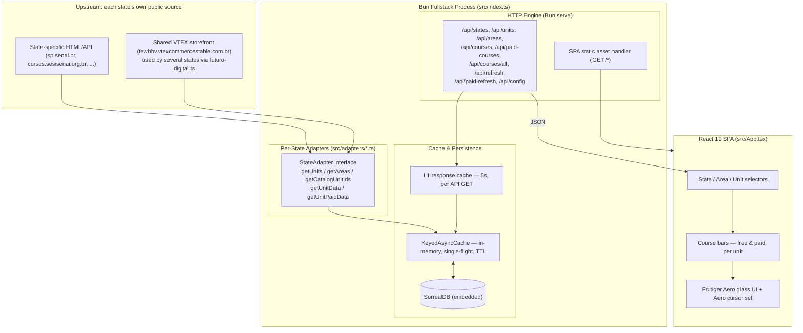

# SENAI Course Intelligence

An open-source real-time course discovery and monitoring platform covering multiple SENAI state federations across Brazil (SENAI-SP, SENAI-SC, and 17 others live, with more states tracked as "coming soon").

The platform continuously aggregates, normalizes, caches, and presents public course and class offerings for every monitored SENAI state through a single, searchable, responsive web interface — no navigating a different portal per state.

[](https://spsenai.arielaram.com)
[](https://github.com/ariel-aram/senai-cursos)
[](LICENSE)
[](https://bun.sh)
[](https://react.dev)
[](https://surrealdb.com)

---

## Quick Links

- **Live Application:** [spsenai.arielaram.com](https://spsenai.arielaram.com)
- **Source Repository:** [github.com/ariel-aram/senai-cursos](https://github.com/ariel-aram/senai-cursos)
- **Contribution Guide:** [CONTRIBUTING.md](CONTRIBUTING.md)

---

## Why This Exists

### Problem

Every Brazilian state runs its own SENAI federation, each publishing course and vacancy data on its own domain, in its own format — some as a normal HTML site, some as a VTEX storefront, some behind a JS-heavy SPA. There is no single place to see "what's open, right now, near me" across states.

### Solution

SENAI Course Intelligence pulls from each state's real, live public data source through a small per-state **adapter** (see [Architecture](#architecture)), normalizes it into one shared schema, caches it, and serves a fast, filterable UI. Every course card links straight back to the state's own official enrollment page — this project never handles enrollment itself.

### Institutional Clarity

This is an independent, community-run project and is **not affiliated with, endorsed by, or representing SENAI, SESI, FIESP, or CNI** at the national or any state level. It does not process enrollments or manage student records. All data is sourced from each state's own public pages/APIs and may lag or drift from the source at any time — always confirm on the official site before enrolling.

---

## Key Features

- **Multi-State Coverage:** One selector across every monitored state (see `STATE_ORDER` in [`src/state-meta.ts`](src/state-meta.ts)); each active state has a real, verified adapter — a state is only flipped from "coming soon" to "active" once its data source has been inspected and confirmed to return real, current offerings.
- **Per-State Adapters, One Shared Schema:** Each state's adapter (`src/adapters/<uf>.ts`) knows how to reach that state's real backend — some are direct HTML/API scrapers (SP, SC), some share a common VTEX storefront backend via `createFuturoDigitalAdapter()` (`src/adapters/futuro-digital.ts`) — and all of them normalize into the same `Course`/`UnitInfo`/`Area` shape (`src/types.ts`).
- **Free vs. Paid Segregation:** Every state's catalog is split into free (bolsa) and paid offerings, each with its own vacancy count, class count, start dates, schedules, and price where available.
- **Area/Category Filtering:** Not just "Tecnologia da Informação" — every área a state's real catalog actually exposes is discoverable per state (`GET /api/areas`), with T.I. only kept as the first-paint default.
- **Resilient Caching:** In-memory single-flight caching (per state, per área) backed by an embedded SurrealDB instance for durability across restarts, plus a 5-second L1 response cache in front of every `/api/*` GET to absorb request bursts.
- **Background Warmup + Proactive Refresh:** Every active state's default área is pre-warmed on server boot, then re-fetched proactively before its cache TTL expires — users hit a warm cache almost all the time, not a cold scrape.
- **Real-Time Client Updates:** Auto-refresh countdown (default 5 min) plus a manual refresh button, both scoped to the currently selected state/área/unit.
- **Frutiger Aero UI:** A glassmorphism interface (translucent glass cards, specular highlights, glow) themed per state via a single `--brand-hue` CSS variable, with an actual custom cursor set — real `.cur`/`.ani` files from a Windows Aero cursor pack, decoded and rendered as native browser cursors (see [`src/lib/cursors.ts`](src/lib/cursors.ts)), colored per state and swapped for context (default pointer, "busy" ring on hoverable states, "not allowed" on coming-soon states, "working" while data loads).
- **Deep Links to Official Portals:** Every course card links straight to that state's own official course page.
- **Single-Process Architecture:** REST API and the pre-bundled React 19 SPA are both served from one native Bun HTTP process — no separate API server or reverse proxy required.

---

## Architecture



### Layer Roles

- **Adapters (`src/adapters/*.ts`):** One file per active state, each implementing the shared `StateAdapter` interface (`src/adapters/types.ts`). Several states (currently MA, MS, GO, TO, PI, RO, CE, MT, PR, ES, PA, PE, RN) share a single implementation, `createFuturoDigitalAdapter(uf, refPrefix)`, since they all sell through the same VTEX storefront backend and are only distinguished by a `"UF|"` prefix on `productReferenceCode`. SP and SC have their own dedicated scrapers. The registry (`src/adapters/registry.ts`) maps `uf -> adapter` and is the actual source of truth for "active" vs. "coming soon" (`src/state-meta.ts`'s `KNOWN_ACTIVE` is only a first-paint hint and is checked against the registry at startup in development).
- **Cache & Persistence (`src/adapters/keyed-cache.ts`, `src/db.ts`):** `KeyedAsyncCache` coalesces concurrent identical requests into one upstream call and treats an empty result as a likely transient failure (not "genuinely zero courses"), so it won't cache a bad zero over real data. SurrealDB (embedded, RocksDB engine — see the comment in `config/config.example.ts` for why SurrealKV specifically doesn't work on this stack) persists the last known-good `Course`/`UnitInfo` rows per state so a cold start still has data to show while the cache re-warms.
- **HTTP Engine (`src/index.ts`):** Serves every `/api/*` route plus the bundled SPA from one `Bun.serve()` call, with a 5-second L1 cache in front of GETs and a scheduled proactive refresh loop that re-warms every active state before its TTL actually expires.
- **Client (`src/App.tsx`, `src/frontend.tsx`, `styles/globals.css`):** A single-page React 19 app — state/area/unit selectors, free/paid course bars, and the Frutiger Aero glass theme, all driven by a `--brand-hue` CSS variable set per selected state.

---

## Technology Stack

| Technology | Role |
| ---------- | ---- |
| **[Bun](https://bun.sh)** (v1.x) | Runtime, bundler, package manager, and HTTP server (`Bun.serve`) |
| **[TypeScript](https://www.typescriptlang.org)** | Static typing across adapters, server, and UI (`src/types.ts` is the shared schema) |
| **[React](https://react.dev)** (v19) | Client UI |
| **[Tailwind CSS](https://tailwindcss.com)** (v4) | Styling, plus the hand-written Frutiger Aero layer in `styles/globals.css` |
| **[SurrealDB](https://surrealdb.com)** | Embedded persistence for the last known-good catalog per state |
| **[ani-cursor](https://github.com/captbaritone/webamp/tree/master/packages/ani-cursor)** | Renders the real `.ani` cursor files as CSS animations in-browser (no native `.ani` support in any browser) |
| **[Biome](https://biomejs.dev)** | Linting and formatting |
| **[Lucide React](https://lucide.dev)** | Iconography |
| **[Radix UI / shadcn-style primitives](https://ui.shadcn.com)** | `Button`, `Card`, and related utilities |

---

## HTTP API Reference

Every route takes a `uf` query param (two-letter state code, e.g. `sp`, `sc`, `mg`) except `/api/states` and `/api/config`.

| Method | Endpoint | Description |
| ------ | -------- | ----------- |
| `GET` | `/api/states` | Lists every known state with its live `active`/`coming-soon` status |
| `GET` | `/api/config` | Returns the default unit ID and refresh-interval seconds for first paint |
| `GET` | `/api/units?uf=&area=` | Lists units of a state that have courses in the given área |
| `GET` | `/api/areas?uf=` | Lists the real áreas (categories) that state's catalog exposes |
| `GET` | `/api/courses?uf=&unit=&area=` | Free courses for a unit/área |
| `GET` | `/api/paid-courses?uf=&unit=&area=` | Paid courses for a unit/área |
| `GET` | `/api/courses/all?uf=&unit=&area=` | Both free and paid in one call — `{ free, paid }` |
| `POST` | `/api/refresh?uf=&unit=&area=` | Forces a fresh fetch of free courses, bypassing cache |
| `POST` | `/api/paid-refresh?uf=&unit=&area=` | Forces a fresh fetch of paid courses, bypassing cache |
| `GET` | `/*` | Serves the SPA |

---

## Development & Setup

### Prerequisites

- [Bun](https://bun.sh) (v1.1.0 or higher)
- Git

### Installation

```bash
git clone https://github.com/ariel-aram/senai-cursos.git
cd senai-cursos
bun install
cp config/config.example.ts config/config.ts
```

### Running

```bash
bun dev     # development server with HMR on http://localhost:3010
bun start   # production mode (NODE_ENV=production)
```

### Scripts

| Command | Purpose |
| ------ | -------- |
| `bun dev` | Dev server with HMR |
| `bun start` | Production server |
| `bun run build` | Bundles the client to `dist/` |
| `bun check` | Biome format + lint, with autofix |
| `bun run tsc` | Type-check without emitting |

---

## Configuration

Copy `config/config.example.ts` to `config/config.ts` and adjust as needed — every field can also be set via environment variable. See the comments in that file for the full, current list (server port/host, SurrealDB path, catalog/unit cache TTLs, fetch timeout & retries, concurrency limits, default unit, and refresh interval).

---

## Adding a State

A state only gets flipped to "active" after its real data source has been inspected and confirmed (see the comments in any existing `src/adapters/<uf>.ts` for the kind of verification expected — real product counts, real available turmas, not just "the page exists"). To add one:

1. Confirm the state's real source and whether it's a VTEX storefront behind the shared `tewbhv` account (check for a `"UF|"` prefix on `productReferenceCode`) or something bespoke.
2. If it's the shared VTEX backend: add `src/adapters/<uf>.ts` calling `createFuturoDigitalAdapter(uf, "UF|")`. If bespoke: write a full `StateAdapter` implementation.
3. Register it in `src/adapters/registry.ts`'s `ADAPTERS` map.
4. Add the state's cosmetic metadata (name, logo, flag, brand hue, `sourceLabel`) to `src/state-meta.ts`, and its uf to `KNOWN_ACTIVE`.

A state with metadata in `state-meta.ts` but no entry in the adapter registry shows up automatically as "coming soon" — no other wiring needed.

---

## Project Status

Active, open-source, maintained for educational, research, and non-commercial public-utility purposes.

## Contributing

This project is licensed under **Apache-2.0** and welcomes contributions — see [CONTRIBUTING.md](CONTRIBUTING.md) for setup, guidelines, and PR expectations.

## Disclaimer

This software independently aggregates publicly accessible data from each state's own SENAI portal. It is **not affiliated with, endorsed by, sponsored by, or associated with SENAI, SESI, FIESP, or CNI**, nationally or in any state. Course availability, schedules, vacancies, and pricing change without notice — always verify on the relevant official portal before enrolling.

## License

Licensed under the **Apache License, Version 2.0**. See [LICENSE](LICENSE) for full terms.
